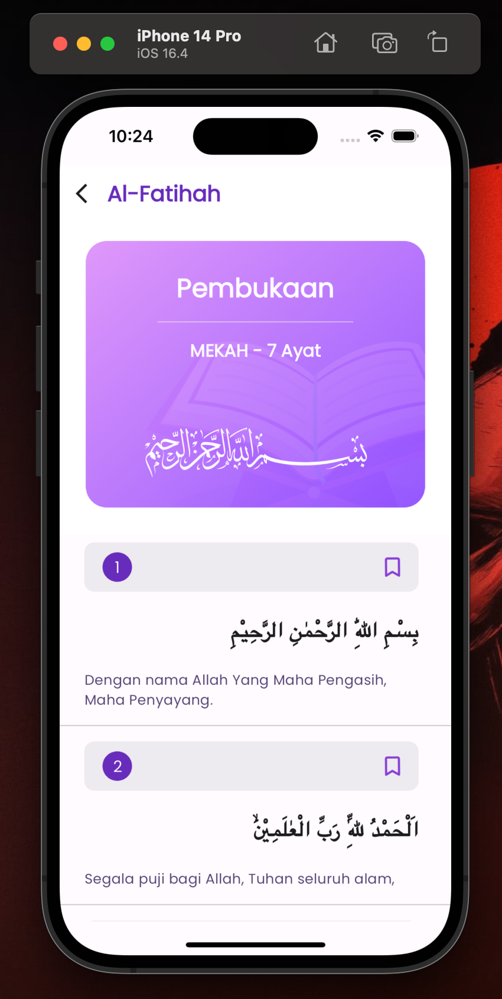

# Flutter Al-Quran App

A simple and beautiful Al-Quran app built with Flutter. Read the holy Quran on the go with this lightweight and easy-to-use application.

[](https://opensource.org/licenses/MIT)
[](https://github.com/whisnuys/flutter-alquran-app)

## 🌟 Features

- **Surah List:** Browse all 114 surahs of the Quran.
- **Verse View:** Read the verses of each surah with a clean and readable interface.
- **Last Read:** (Work in Progress) Quickly jump back to where you left off.
- **Offline Reading:** Access the Quran anytime, even without an internet connection.
- **Murottal Audio:** (Work in Progress) Listen to the beautiful recitation of the Quran.
- **Bookmarking:** (Work in Progress) Save your favorite verses for later reference.

## 📸 Screenshots

| Surah Page & Verse Page                                                 |
| ----------------------------------------------------------------------- |
|   |

## 🛠️ Getting Started

### Prerequisites

- Flutter SDK: [Installation Guide](https://flutter.dev/docs/get-started/install)
- An IDE like Android Studio or VS Code with the Flutter plugin.

### Installation

1.  **Clone the repository:**
    ```bash
    git clone [https://github.com/whisnuys/flutter-alquran-app.git](https://github.com/whisnuys/flutter-alquran-app.git)
    ```
2.  **Navigate to the project directory:**
    ```bash
    cd flutter-alquran-app
    ```
3.  **Install dependencies:**
    ```bash
    flutter pub get
    ```
4.  **Run the app:**
    ```bash
    flutter run
    ```

## 💻 Technology Stack

- **Framework:** [Flutter](https://flutter.dev/)
- **Language:** [Dart](https://dart.dev/)
- **API:** [EQuran.id API](https://equran.id/)
- **State Management:** [Bloc (Cubit)](https://bloclibrary.dev/)
- **Local Storage:** [sqflite](https://pub.dev/packages/sqflite)

## 🚀 Roadmap

Here are some of the features we plan to add in the future:

- [ ] Fix Last Read feature
- [ ] Add bookmarking functionality
- [ ] Integrate at least one Murottal audio
- [ ] Implement a bottom navigation bar for easier navigation
