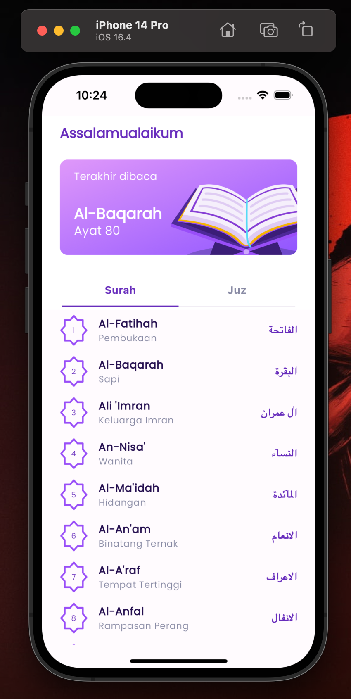

# Flutter Al Quran App

Flutter Tutorial for Design layouting and integration data from API purpose for Reading and Learning Al Quran

## ScreenShot

| Home           |
|------------------------|
| |

