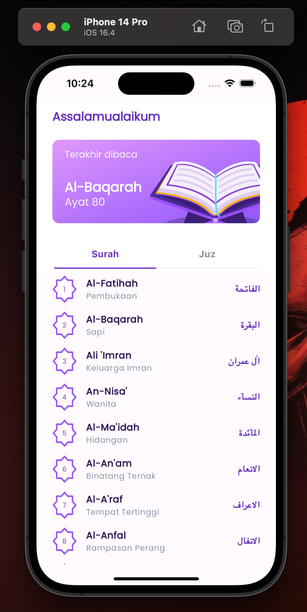
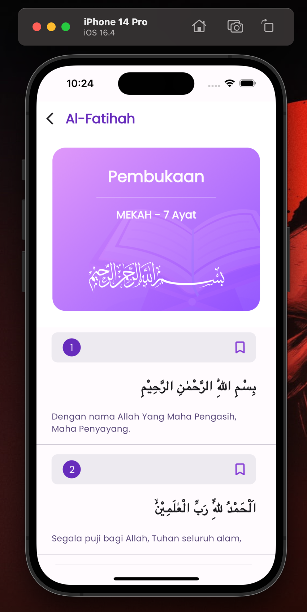

# Flutter Al Quran App

Flutter Tutorial for Design layouting and integration data from API purpose for Reading and Learning Al Quran

## TODO

- Improve Ui (Home, Surah, Detail Surah)
- Fix Alignment Detail Surah
- Adding integration for local storage

## ScreenShot

| Home                                |
| ----------------------------------- |
|  |
|  |
